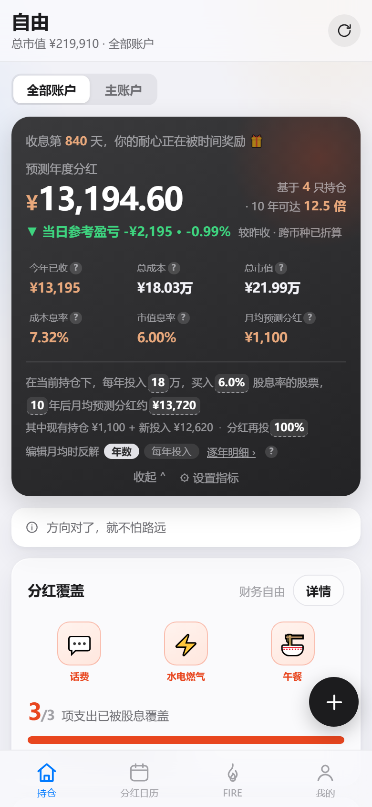
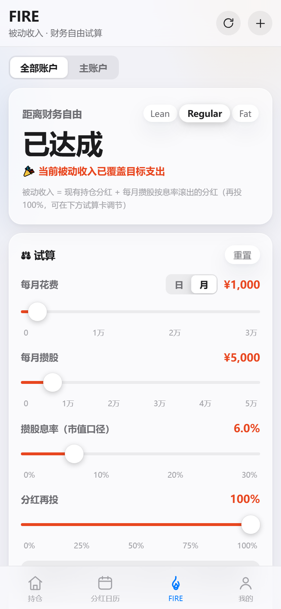
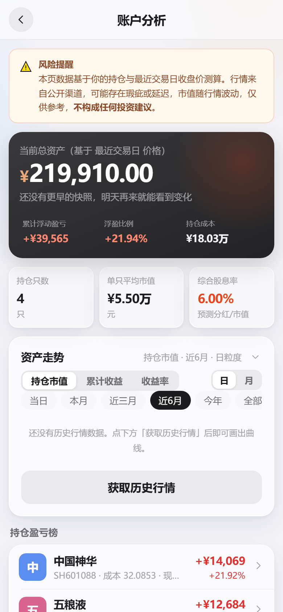

# 自由 · 股息收入追踪

一个**单文件网页应用**：记录持仓与分红、自动同步分红方案、推演财务自由（FIRE）进度。数据全部保存在你自己的浏览器里，无需注册、无需服务器，双击即用，支持手机 / 平板 / 电脑与深浅双模式。

> **只做记录。** 本应用不提供股票买卖、不推荐任何标的、不构成任何投资建议。这是一个独立的个人开源项目，与任何同类商业产品均无关联。

| 持仓 | FIRE | 分红日历 |
|---|---|---|
|  |  |  |

| 账户分析 | 我的 |
|---|---|
|  |  |

---

## 功能

### 📊 持仓

- 年度分红总览卡：预测年度分红、今年已收、成本息率 / 市值息率（指标可自定义）
- 资产走势：持仓市值 / 净资产 / 收益率（TWR），支持当日分时、多区间切换与指数对比
- 持仓卡片：官方图标、红涨绿跌、技术信号标记（BOLL 下轨 / KDJ，文案中性）、分时走势 sparkline
- 持仓永远由交易流水推导，支持三种成本口径（默认分红摊薄：分红到账后成本自动下降）
- 添加方式：手动搜索添加，或上传券商持仓截图自动识别（见下方 OCR 说明）

### 🔥 FIRE

- 距离财务自由的预计时间（精确到月），基于「现有持仓分红 + 每月攒股 × 攒股息率」的被动收入模型
- 四根试算滑杆：每日 / 每月消费、每月攒股、攒股息率（市值口径）、分红再投比例——拖动即实时联动
- 三档目标：Lean（覆盖生存支出）/ Regular（覆盖全部支出）/ Fat（覆盖生存 + 200% 品质支出）
- 被动收入覆盖率曲线：历史实际到账 + 未来外推，可超 100%，支持多时间尺度
- FI 进度：FI 本金 ÷ 所需生息资产（按当前市值息率折算，随行情自动更新），七档时间尺度
- 支出分类：生存 / 品质两组自由编辑，作为三档目标的分母

### 📅 分红日历

- 自动同步 A股 / 港股 / ETF 的分红方案，除权日 / 派息日提醒
- 月历三色点（登记 / 除权 / 派息）、年度总览、待除权提示（除权日已定与待定两类）
- 分红记录自动入账（可手动确认），分红台账按标的 / 年份展开

### 📈 账户分析

- 多账户切换、收益来源拆解（买卖盈亏 / 分红 / 成本摊薄）
- 逐标的收益率与持仓成本回本进度

### ⚙️ 我的

- 账户管理、交易流水、数据管理（JSON 导出 / 导入、CSV 台账、跨设备搬运、清空）
- **跨设备搬运**：核心数据编码为一段文本（gzip 压缩，不含任何密钥），通过微信 / QQ 发到另一台设备粘贴导入，可选合并（自动去重）或覆盖，不经过任何服务器
- 深色模式跟随系统；PWA 安装后断网可用

### 📷 截图识别（可选）

上传券商持仓截图（支持多张），由大模型识别股票与交易记录，逐行核对后批量导入。

- 使用前需自行前往 [智谱开放平台](https://open.bigmodel.cn) **免费申请 API Key**，然后填入「我的 → 截图识别设置」中的 **OCR Key 输入框**
- 首次使用会提示「截图会上传第三方服务」的隐私确认，确认后才会启用
- 本项目分发的代码与仓库中**不包含任何 API Key**

---

## 数据来源

| 数据 | 来源 |
|---|---|
| A股 / 港股 / 美股 / ETF 行情与汇率 | 腾讯财经公开接口 |
| 历史日线 / 当日分时 | 腾讯财经公开接口 |
| A股分红送配 | 东方财富公开接口 |
| 港股分红 | 东方财富公开接口 |
| 基金 / ETF 分红与净值 | 天天基金公开接口 |
| 截图识别 | 智谱 AI GLM-4V（用户自行申请 Key，直连，无后端） |

除 OCR 外全部通过 `<script>` 注入或 JSONP 实现，`file://` 本地打开即可使用。

---

## 快速开始

1. 双击打开 `dist/自由.html`，或在手机浏览器访问部署好的网址
2. 点右下角悬浮 **＋** → 手动添加持仓，或用截图识别批量导入
3. 到 FIRE 页把「每月花费」改成你的真实支出，即可看到你的财务自由时间线

### 作为 PWA 安装

```bash
node build.mjs     # 生成 dist/自由.html 与 dist/pwa/
```

把 `dist/pwa/` 部署到任意静态托管（本仓库使用 GitHub Pages）。手机浏览器打开后「添加到主屏幕」即可获得独立 App。

---

## 开发

```bash
node build.mjs              # 重新构建（改了 src/ 之后必须执行）
node verify.mjs             # 数值验收：独立复算断言，与页面结果逐位比对
node uitest.mjs             # 多端 UI 验收（CDP 驱动，全程断网）
node tools/test-fire.mjs    # FIRE 计算引擎单测
```

**架构**：`views → store → calc / fetcher` 严格单向；`calc.js` 全部纯函数，页面显示的每个数字都有独立复算断言。

```
src/
├── util.js     日期 / 数值 / 格式化
├── market.js   市场抽象：代码规范化 · 币种 · 行情字段 · 图标候选链
├── model.js    数据模型 · 校验 · 导入导出 · 迁移
├── storage.js  IndexedDB → localStorage 降级
├── transfer.js 跨设备搬运（gzip + base64url · 合并去重）
├── fetcher.js  取数层（行情 / 汇率 / 分红 / 分时 / 图标）
├── ocr.js      截图识别（智谱 GLM-4V）
├── chart.js    图表（对比曲线 · 分时 · 散点 · brush，零依赖内联 SVG）
├── calc.js     计算引擎（全部纯函数）
├── store.js    单一状态源 + 订阅
├── ui.js       图标 / 弹层 / Toast / 事件委托
├── views/      overview · calendar · plan(FIRE) · divsummary · analysis · networth · symbol · mine
└── app.js      启动 / 路由 / 交互动作
```

---

## 部署

产物 `dist/pwa/` 已提交进仓库。两种方式：仓库 Settings → Pages → Source 选「GitHub Actions」自动部署；或 `node tools/deploy-github.mjs`（GitHub 令牌放未跟踪的 `.token` 文件）。

---

## 免责声明

1. 本应用仅用于**个人分红记录的整理与回顾**，不提供任何投资建议、收益承诺或买卖推荐
2. 所有行情与分红数据来自第三方公开接口，可能存在延迟、缺失或错误，请以券商与交易所正式披露为准
3. FIRE 试算结果是基于用户自填参数的假设性推演，不代表任何实际收益预测
4. 本应用按「现状」提供，作者不对使用本应用产生的任何直接或间接损失承担责任
5. 请遵守所在地区法律法规；投资有风险，决策需独立判断

## 许可证

本项目基于 [MIT License](LICENSE) 开源。
